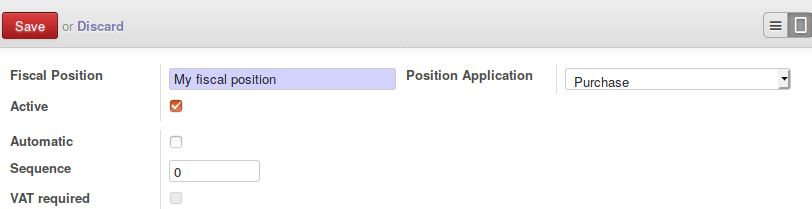

To configure this module, you need to:

* Go to Invoicing / Configuration / Taxes / Fiscal Positions

* On a fiscal position, set the correct settings.

**Note**

It is possible to set the value on the fiscal position templates. In that
case, installing a new chart of account will configure correctly the fiscal
positions.
