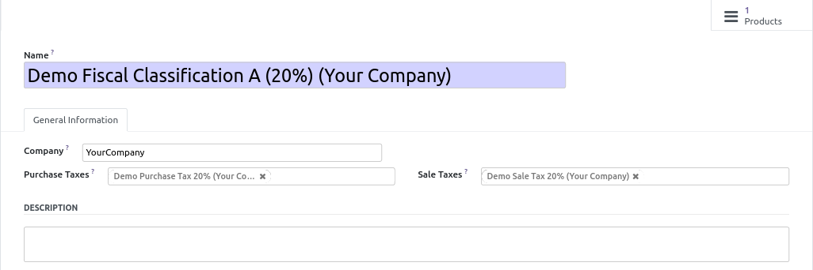
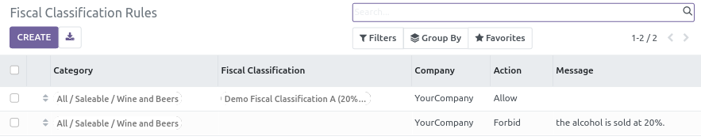
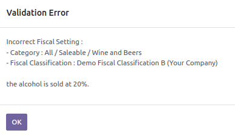

* Go to "Accounting > Configuration > Accounting > Fiscal Classifications".

* Create new classification, with correct purchase and sale taxes.

**Note**

When installing the module, it will create fiscal classifications for all
the taxes combinations that exist in your database.
If some are bad, you can massively move the products for a bad classification
to the good one, using the button "Move products into another fiscal classification".

**Optional settings**

Once the fiscal classifications are created, you can create rules to avoid
users to use some classifications that don't make sense for some categories.

* Go to "Accounting > Configuration > Accounting > Fiscal Classification Rules"
* Create new rules.

Every time a new product is created, the rules that matches the product setting will
be checked **in the displayed order**.

* If one rule is set to 'Allow', the next rules are ignored.
* If one rule is set to 'Forbid', an error is raised.

