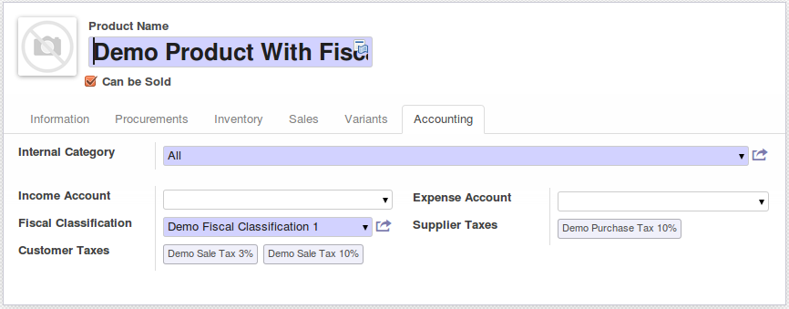

* Add a new light concept 'fiscal_classification' to associate possible
  purchase and sale taxes;

* Make more usable taxes selection in product view. The user has now the
  possibility to select a fiscal classification, instead of select manually
  all the taxes;

* Prevent users to select incompatible purchase and sale taxes.
  French Exemple: A product can not be configured with:

  * Purchase Taxes: 5.5%;
  * Sale Taxes: 20%;

* Provides the possibility to the account manager to change incorrect
  parameters massively;
