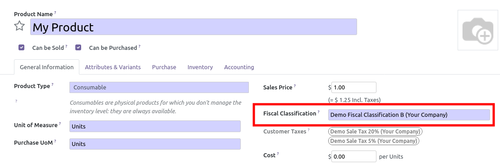

This module extends the Odoo Account module to introduce Fiscal Classifications.

A fiscal classification is an association of purchase and sale taxes that
have to be set on your products.

This new design provides the following improvments.

* It is more simple (less clicks quantity) to configure correctly a product.
  (You only have to set a fiscal classification, instead of setting one or many
  sale taxes, then click on purchase tab and set one or many purchase taxes.)

* Prevent users to select incompatible purchase and sale taxes.
  French Exemple: A product can not be configured with:

  * Purchase Taxes: 5.5%
  * Sale Taxes: 20%

* Optionaly, you can restrict the usage of some fiscal classifications to
  some product categories.
  French Exemple : A product set in the category "Beer and wine" can not
  have a sale tax 5,5%. (20% is mandatory)
