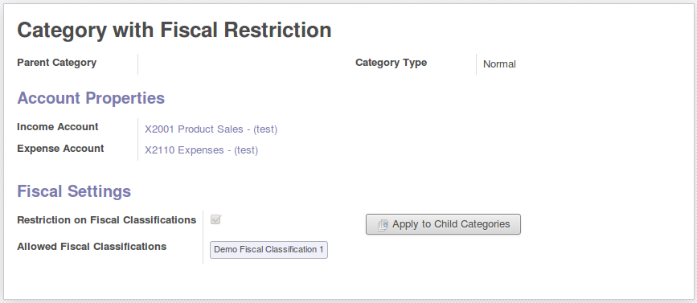
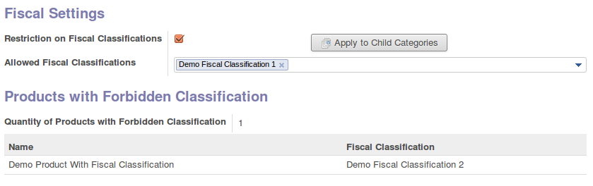

* Add possibility to restrict fiscal settings on product, depending of its
  category

If you do so, user will not have the possibility to set a fiscal classification
if product category settings do not allow.

Accounting people can see products that are bad set, in product category form
view.

